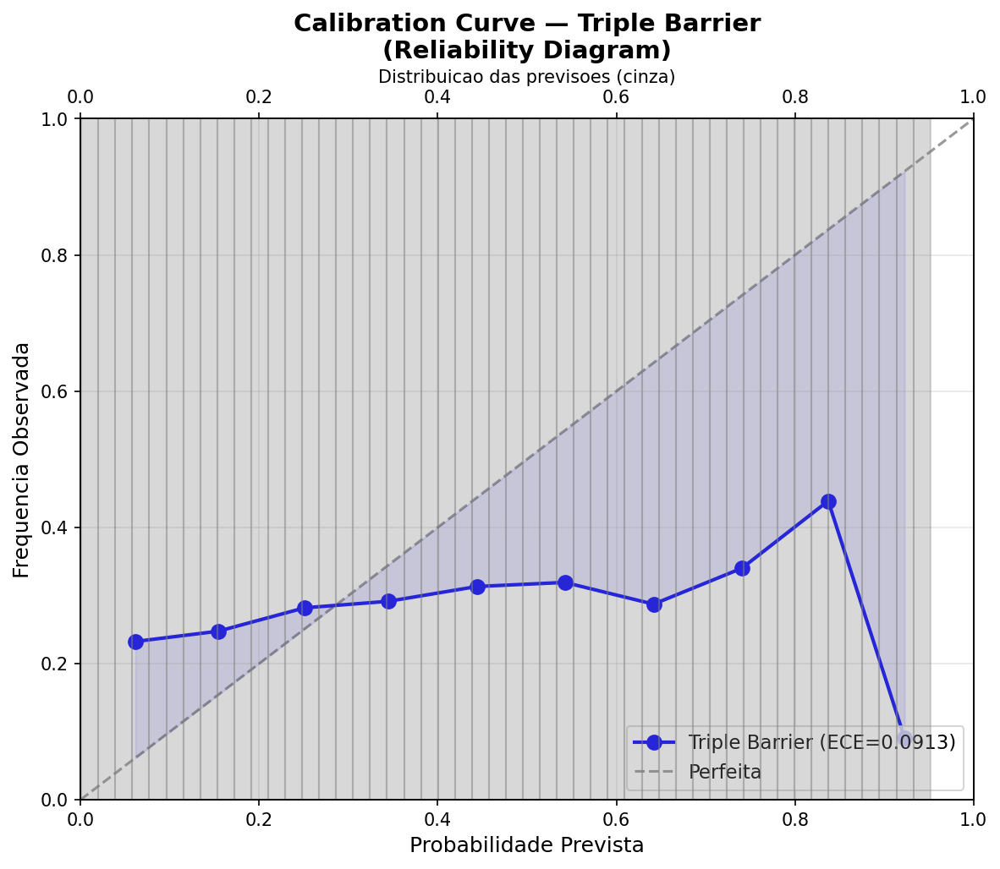
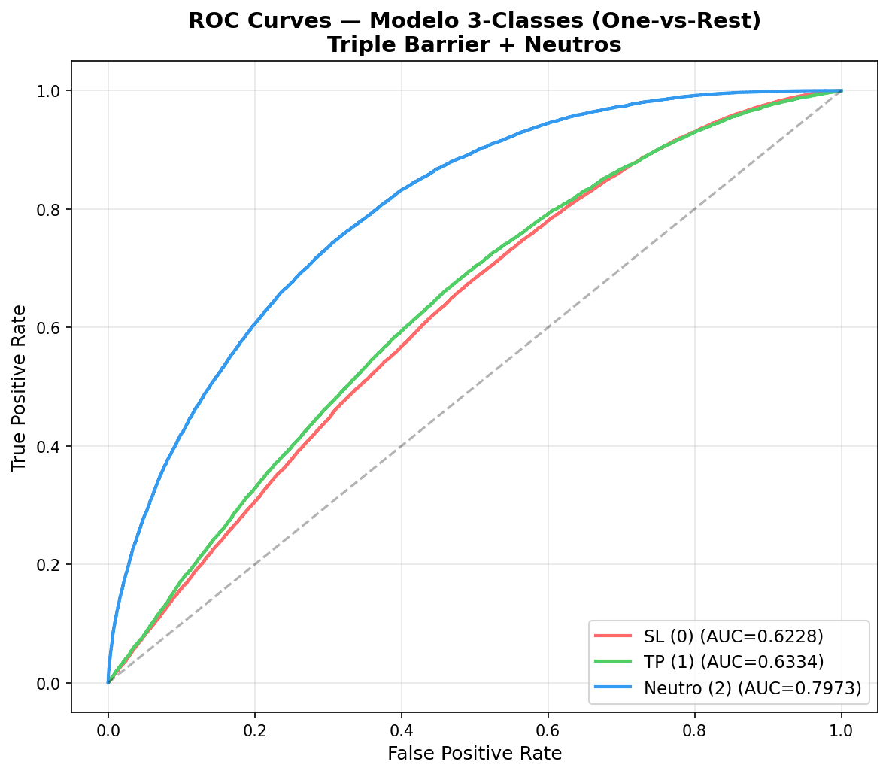

# Auditoria Triple Barrier v2

**Data:** 2026-06-06 13:52:00
**Parametros:** TP +0.40% / SL -0.20% / Time 12 candles (60 min)
**Modelo:** LightGBM (identico ao v1)

---

## Q1. Distribuicao Bruta das Barreiras

| Resultado | Contagem | Percentual |
|-----------|----------|------------|
| TP primeiro | 18,177 | 18.23% |
| SL primeiro | 48,658 | 48.8% |
| Nenhuma barreira (descarte) | 32,878 | 32.97% |
| **Total** | **99,713** | **100%** |

- **Ratio TP/SL:** 0.374
- **Taxa de aproveitamento:** 67.03%
- **Taxa de descarte:** 32.97%

---

## Q2. ROC AUC por Fold

| Fold | AUC |
|------|-----|
| 0 | 0.5306 |
| 1 | 0.5130 |
| 2 | 0.5604 |
| 3 | 0.5355 |
| 4 | 0.5526 |

- **Media:** 0.5384
- **Std:** 0.0167

---

## Q3. LogLoss por Fold

| Fold | LogLoss |
|------|---------|
| 0 | 0.6878 |
| 1 | 0.6544 |
| 2 | 0.6146 |
| 3 | 0.6319 |
| 4 | 0.5763 |

---

## Q4. Brier Score por Fold

| Fold | Brier |
|------|-------|
| 0 | 0.2206 |
| 1 | 0.2240 |
| 2 | 0.2113 |
| 3 | 0.2186 |
| 4 | 0.1935 |

---

## Q5. Precision por Faixa de Probabilidade

| Faixa | N Amostras | % Total | TP Count | Precision |
|-------|-----------|---------|----------|-----------|
| 50-55% | 1,609 | 2.9% | 529 | 0.3288 |
| 55-60% | 1,020 | 1.84% | 310 | 0.3039 |
| 60-65% | 647 | 1.17% | 185 | 0.2859 |
| 65-70% | 401 | 0.72% | 116 | 0.2893 |
| >70% | 512 | 0.92% | 181 | 0.3535 |

---

## Q6. Calibration Curve

- **ECE (Expected Calibration Error):** 0.0913
- **Bins:** 10

| Bin | Intervalo | N | % Total | Prev Media | Freq Obs | Gap |
|-----|----------|---|---------|------------|----------|-----|
| 1 | [0.0, 0.1) | 4,996 | 9.0% | 0.0615 | 0.2324 | 0.1709 |
| 2 | [0.1, 0.2) | 11,802 | 21.25% | 0.1542 | 0.2475 | 0.0933 |
| 3 | [0.2, 0.3) | 16,101 | 28.99% | 0.2510 | 0.2818 | 0.0309 |
| 4 | [0.3, 0.4) | 12,433 | 22.39% | 0.3448 | 0.2914 | 0.0534 |
| 5 | [0.4, 0.5) | 6,014 | 10.83% | 0.4437 | 0.3131 | 0.1306 |
| 6 | [0.5, 0.6) | 2,629 | 4.73% | 0.5422 | 0.3191 | 0.2231 |
| 7 | [0.6, 0.7) | 1,048 | 1.89% | 0.6417 | 0.2872 | 0.3545 |
| 8 | [0.7, 0.8) | 403 | 0.73% | 0.7405 | 0.3400 | 0.4006 |
| 9 | [0.8, 0.9) | 98 | 0.18% | 0.8372 | 0.4388 | 0.3985 |
| 10 | [0.9, 1.0) | 11 | 0.02% | 0.9227 | 0.0909 | 0.8318 |

---

## Q7. Concentracao de Previsoes

| Estatistica | Valor |
|-------------|-------|
| Media | 0.2811 |
| Mediana | 0.2688 |
| Std | 0.1429 |
| Min | 0.0009 |
| Max | 0.9516 |

| Faixa | N | % |
|-------|---|---|
| <0.30 | 32,899 | 59.2% |
| 0.30-0.40 | 12,433 | 22.4% |
| 0.40-0.50 | 6,014 | 10.8% |
| 0.50-0.60 | 2,629 | 4.7% |
| 0.60-0.70 | 1,048 | 1.9% |
| 0.70-0.80 | 403 | 0.7% |
| >0.80 | 109 | 0.2% |

- **Faixa mais concentrada:** <0.30 (59.2%)
- **Concentracao excessiva?** NAO

---

## Q8. Win Rate por Threshold

| Threshold | N Sinais | % Total | Win Rate | TP/SL |
|-----------|----------|---------|----------|-------|
| >0.50 | 4,189 | 7.54% | 0.3153 (31.5%) | 1321/2868 |
| >0.55 | 2,580 | 4.65% | 0.3070 (30.7%) | 792/1788 |
| >0.60 | 1,560 | 2.81% | 0.3090 (30.9%) | 482/1078 |
| >0.65 | 913 | 1.64% | 0.3253 (32.5%) | 297/616 |
| >0.70 | 512 | 0.92% | 0.3535 (35.4%) | 181/331 |

- **Baseline WR (sem filtro):** 0.2781 (27.8%)

---

## Q9. Evidencia de Dataset Simplificado?

| Metrica | Neutros | Rotulados | Ratio N/R |
|---------|---------|-----------|-----------|
| Volatilidade media | 0.00098 | 0.00204 | 0.484 |
| Retorno abs medio | 0.000517 | 0.001042 | 0.496 |

**Evidencias encontradas:**
- Neutros tem volatilidade MENOR que rotulados
- Neutros tem retorno absoluto MENOR que rotulados
- >25% dos dados descartados como neutro
- Forte desbalanceamento TP/SL (>2.5:1)

**Conclusao:** **SIM** — ha evidencias de que o descarte de neutros simplificou artificialmente o dataset.

---

## Q10. AUC com 3 Classes (Neutros Reintroduzidos)

| Classe | AUC (one-vs-rest) |
|--------|-------------------|
| SL (0) | 0.6228 |
| TP (1) | 0.6334 |
| Neutro (2) | 0.7973 |

- **AUC Macro (media 3 classes):** 0.6845
- **AUC Binario derivado (TP vs SL):** 0.5373
- **AUC Binario original (modelo 2-class):** 0.5396
- **Ganho de AUC mantido (>0.5104 baseline)?** **SIM** — o ganho se mantem apos reintroduzir neutros.

---

## Sumario da Auditoria

| Questao | Achado Principal |
|---------|-----------------|
| Q1 | 32.97% dos dados sao descartados como neutros |
| Q2-Q4 | AUC 0.5384 +/- 0.0167 nos folds |
| Q5 | Precisao melhora com threshold mais alto |
| Q6 | ECE = 0.0913 |
| Q7 | Distribuicao adequada das previsoes |
| Q8 | WR baseline = 27.8% |
| Q9 | Dataset potencialmente simplificado |
| Q10 | Ganho de AUC mantido no modelo 3-class |

---

*Auditoria gerada automaticamente — 2026-06-06 13:52:00*
