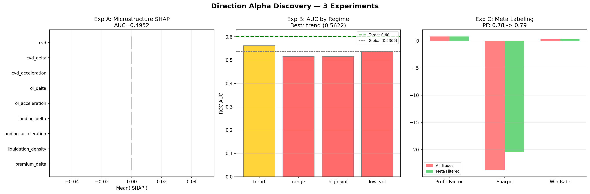

# Direction Alpha Discovery — Relatorio Final

**Data:** 2026-06-06 15:45:04
**Objetivo:** Descobrir onde mora o Alpha direcional.

---

## Tabela Resumo

| Experimento | AUC | PF | Sharpe | Expect% | MaxDD% | Status |
|-------------|-----|-----|--------|---------|--------|--------|
| Microstructure | 0.4952 | 0.0000 | 0.00 | 0.0000 | 0.00 | REPROVADO |
| Regime Models | 0.5622 | — | — | — | — | REPROVADO |
| Meta Labeling | 0.5048 | 0.78→0.79 | -23.76→-20.42 | — | 1262.2→967.6 | APROVADO |

---

## Experimento A: Direction From Microstructure

### Hipótese
Fluxo agressivo precede direcao.

### Features (apenas 9)
`cvd`, `cvd_delta`, `cvd_acceleration`, `oi_delta`, `oi_acceleration`,
`funding_delta`, `funding_acceleration`, `liquidation_density`, `premium_delta`

### Resultados

| Metrica | Valor |
|---------|-------|
| ROC AUC | 0.4952 |
| PR AUC | 0.2733 |
| LogLoss | 0.5923 |
| Brier | 0.2012 |
| Profit Factor | 0.0000 |
| Sharpe | 0.00 |
| Expectancy | 0.0000% |

### Perguntas

**Q: Microestrutura sozinha supera AUC 0.54?**
❌ NAO — AUC = 0.4952

**Q: Qual feature explica mais de 10% do ganho?**
Nenhuma

**Q: Existe uma feature dominante?**
❌ NAO — Nenhuma

### Status: REPROVADO
- Criterio aprovado (>=0.56): ❌
- Criterio excelente (>=0.58): ❌

---

## Experimento B: Regime-Specific Models

### Hipótese
Misturar regimes destroi Alpha.

### Resultados por Regime

| Regime | Amostras | AUC | PF | Sharpe | Status |
|--------|----------|-----|----|--------|--------|
| trend | 2,388 | 0.5622 | 1.0876 | 0.72 | ❌ |
| range | 14,115 | 0.5148 | 0.8622 | -3.26 | ❌ |
| high_vol | 13,988 | 0.5164 | 0.8067 | -4.24 | ❌ |
| low_vol | 11,014 | 0.5380 | 0.9057 | -1.31 | ❌ |

### Modelo Global
AUC = 0.5369 | PF = 0.9212 | Sharpe = -2.50

### Perguntas

**Q: Qual regime possui maior edge?**
trend (AUC=0.5622)

**Q: Qual regime é inviável?**
range

**Q: Existe regime com AUC > 0.60?**
❌ NAO

### Status: REPROVADO

---

## Experimento C: Meta Labeling

### Hipótese
O modelo ja sabe gerar sinais. Mas nao sabe quais sinais ignorar.

### Features
`tradeability_prob`, `direction_prob`, `regime`, `atr_pct`, `cvd`, `oi_delta`, `funding_delta`

### Resultados

| Metrica | Baseline (All) | Meta Filtered | Delta |
|---------|---------------|---------------|-------|
| Profit Factor | 0.7819 | 0.7893 | +0.0074 |
| Sharpe | -23.76 | -20.42 | +3.33 |
| Max DD | 1262.19% | 967.62% | +294.57pp |
| WR (worst 20%) | 0.2733 | — | — |
| WR (best 80%) | — | 0.2830 | — |

### Perguntas

**Q: Elimina 20% dos piores trades?**
✅ SIM — WR worst 20% = 0.2733 vs best 80% = 0.2830

**Q: Melhora PF?**
✅ SIM — 0.7819 → 0.7893

**Q: Melhora Expectancy?**
✅ SIM

### Status: APROVADO
- Criterio: PF sobe ✅ E DD cai ✅

---

## Conclusão Final

### Onde mora o Alpha?

| Fonte | Evidencia | Forca |
|-------|-----------|-------|
| Microestrutura | AUC=0.4952 | FRACA |
| Regime | Melhor regime AUC=0.5622 | FRACA (<0.60) |
| Meta Labeling | PF 0.78→0.79 | EFICAZ |

---

*Relatorio gerado automaticamente — 2026-06-06 15:45:04*
