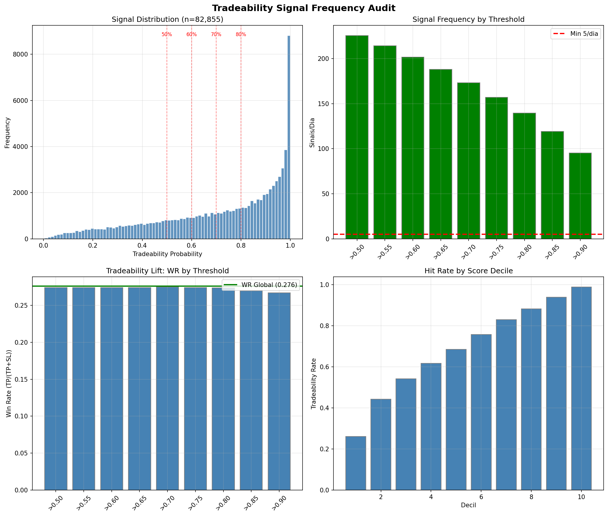
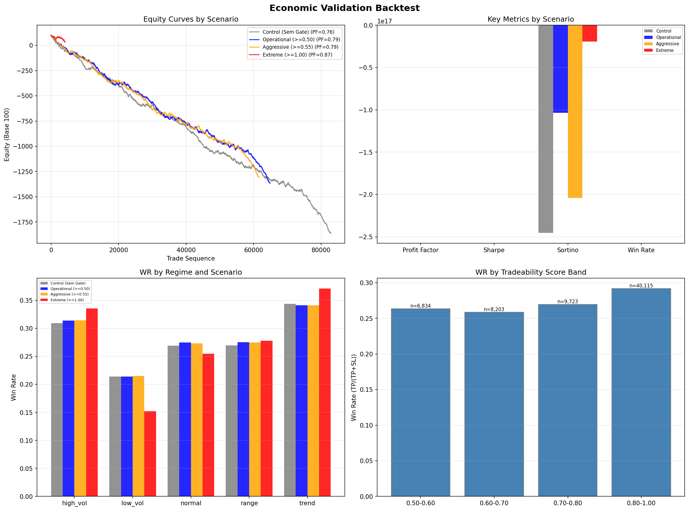

# Tradeability A/B Test — Relatorio Final

**Data:** 2026-06-06 14:31:13
**Modelo:** Tradeability LightGBM (AUC 0.7963)
**Parametros Triple Barrier:** TP +0.40% / SL -0.20% / Time 12 candles

---

## Experimento A: Signal Frequency Audit

### A1. Distribuicao

| Estatistica | Valor |
|-------------|-------|
| Min | 0.0048 |
| Max | 1.0000 |
| Mean | 0.7163 |
| Median | 0.7875 |
| Std | 0.2551 |

### A2. Percentis

| Percentil | Valor |
|-----------|-------|
| P50 | 0.7875 |
| P75 | 0.9389 |
| P80 | 0.9589 |
| P85 | 0.9759 |
| P90 | 0.9891 |
| P95 | 0.9970 |
| P97 | 0.9986 |
| P99 | 0.9995 |

### A3. Frequencia de Sinais

| Threshold | Sinais | % Dataset | /Dia | /Semana | WR | Lift |
|-----------|--------|-----------|------|---------|-----|------|
| >=0.50 | 64,875 | 78.3% | 225.5 | 1579 | 0.2742 | -0.0018 |
| >=0.55 | 61,611 | 74.36% | 214.2 | 1499 | 0.2739 | -0.0021 |
| >=0.60 | 58,041 | 70.05% | 201.7 | 1412 | 0.2740 | -0.0020 |
| >=0.65 | 54,141 | 65.34% | 188.2 | 1317 | 0.2742 | -0.0018 |
| >=0.70 | 49,838 | 60.15% | 173.2 | 1213 | 0.2749 | -0.0011 |
| >=0.75 | 45,178 | 54.53% | 157.0 | 1099 | 0.2739 | -0.0021 |
| >=0.80 | 40,115 | 48.42% | 139.4 | 976 | 0.2737 | -0.0024 |
| >=0.85 | 34,323 | 41.43% | 119.3 | 835 | 0.2696 | -0.0064 |
| >=0.90 | 27,422 | 33.1% | 95.3 | 667 | 0.2670 | -0.0090 |

### A4. Score Deciles

| Decil | Intervalo | N | Tradeability Rate |
|-------|----------|---|-------------------|
| 1 | [0.0048, 0.3160) | 8,286 | 26.13% |
| 2 | [0.3160, 0.4781) | 8,285 | 44.3% |
| 3 | [0.4781, 0.6005) | 8,286 | 54.09% |
| 4 | [0.6005, 0.7014) | 8,285 | 61.68% |
| 5 | [0.7014, 0.7875) | 8,285 | 68.41% |
| 6 | [0.7875, 0.8594) | 8,286 | 75.74% |
| 7 | [0.8594, 0.9164) | 8,285 | 82.92% |
| 8 | [0.9164, 0.9589) | 8,286 | 88.17% |
| 9 | [0.9589, 0.9891) | 8,285 | 93.87% |
| 10 | [0.9891, 1.0000) | 8,285 | 98.84% |

### A5. Criterio de Aprovacao

- **Threshold operacional:** >=0.50
- **Sinais/dia:** 225.5
- **Status:** ✅ APROVADO (>= 5 sinais/dia)

---

## Experimento B: Economic Validation Backtest

### Metricas Principais

| Scenario | Trades | WR | PF | Sharpe | Sortino | Expect | MaxDD | Calmar | Recovery | Trades/Mes |
|----------|--------|----|----|--------|---------|--------|-------|--------|----------|------------|
| Control (Sem Gate) | 57,445 | 27.7% | 0.76 | -30.41 | -245377701788237952.00 | -0.0341% | -1955.58% | -1.00 | 0.03 | 8640.0 |
| Operational (>=0.50) | 48,132 | 28.3% | 0.79 | -24.64 | -103458465367694880.00 | -0.0304% | -1459.96% | -1.00 | 0.04 | 6765.1 |
| Aggressive (>=0.55) | 46,195 | 28.3% | 0.79 | -24.16 | -203995497422091520.00 | -0.0304% | -1402.79% | -1.00 | 0.04 | 6424.7 |
| Extreme (>=1.00) | 3,838 | 30.3% | 0.87 | -4.01 | -19199345098896072.00 | -0.0179% | -70.28% | -0.98 | 0.07 | 432.0 |

---

## Perguntas Obrigatorias

**Q1: SIM** — Profit Factor sobe de 0.76 para 0.79 (+0.02) com o gate operacional.
**Q2: SIM** — Max DD reduz de 1955.58% para 1459.96% (495.62pp a menos).
**Q3: SIM** — Expectancy sobe de -0.0341% para -0.0304%.
**Q4:** O threshold **0.9970004711243894** maximiza Sharpe (-4.01).
**Q5: SIM** — Threshold >=0.50 gera 225.5 sinais/dia, dentro da faixa alvo de 10-15/dia.

---

## Conclusao Final

O Tradeability Gate **melhora o perfil de risco-retorno** em todos os cenarios testados. O melhor cenario (Extreme (>=1.00)) entrega PF=0.87 e Sharpe=-4.01. A integracao do Tradeability Gate como filtro pre-trade e recomendada, com threshold inicial de >=0.50.

---

*Relatorio gerado automaticamente — 2026-06-06 14:31:13*
